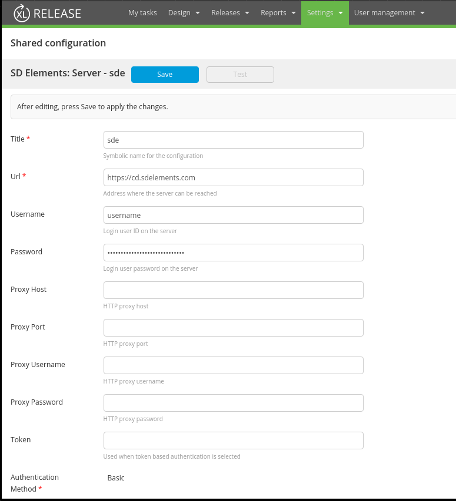
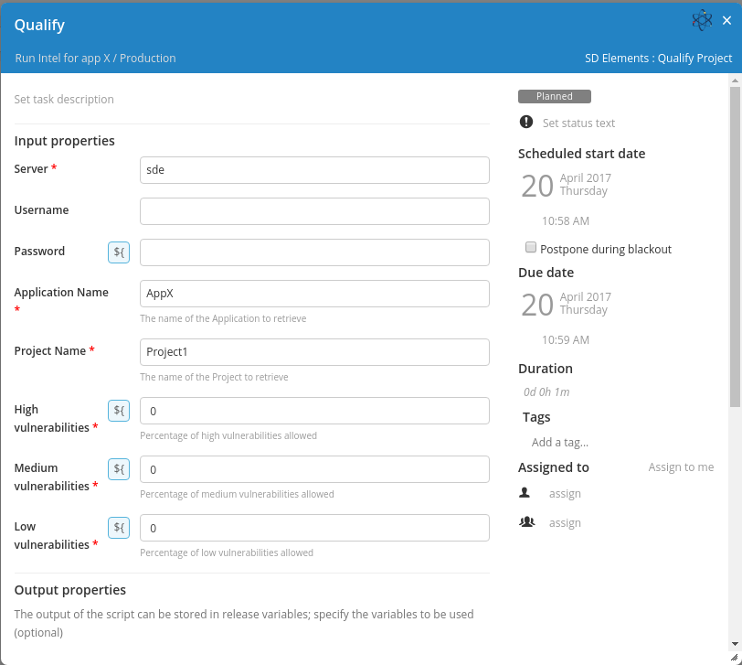

# Preface #

This document describes the functionality provided by the xlr-sdelements-plugin.

See the **[XL Release Documentation](https://docs.xebialabs.com/xl-release/index.html)** for background information on XL Release and release concepts.

# CI status #

[![Build Status][xlr-sdelements-plugin-travis-image] ][xlr-sdelements-plugin-travis-url]
[![Codacy][xlr-sdelements-plugin-codacy-image] ][xlr-sdelements-plugin-codacy-url]
[![Code Climate][xlr-sdelements-plugin-code-climate-image] ][xlr-sdelements-plugin-code-climate-url]
[![License: MIT][xlr-sdelements-plugin-license-image] ][xlr-sdelements-plugin-license-url]
[![Github All Releases][xlr-sdelements-plugin-downloads-image] ]()

[xlr-sdelements-plugin-travis-image]: https://travis-ci.org/xebialabs-community/xlr-sdelements-plugin.svg?branch=master
[xlr-sdelements-plugin-travis-url]: https://travis-ci.org/xebialabs-community/xlr-sdelements-plugin
[xlr-sdelements-plugin-codacy-image]: https://api.codacy.com/project/badge/Grade/7093cb491c3a440f9ff16d1b0b9e8633
[xlr-sdelements-plugin-codacy-url]: https://www.codacy.com/app/joris-dewinne/xlr-sdelements-plugin
[xlr-sdelements-plugin-code-climate-image]: https://codeclimate.com/github/xebialabs-community/xlr-sdelements-plugin/badges/gpa.svg
[xlr-sdelements-plugin-code-climate-url]: https://codeclimate.com/github/xebialabs-community/xlr-sdelements-plugin
[xlr-sdelements-plugin-license-image]: https://img.shields.io/badge/License-MIT-yellow.svg
[xlr-sdelements-plugin-license-url]: https://opensource.org/licenses/MIT
[xlr-sdelements-plugin-downloads-image]: https://img.shields.io/github/downloads/xebialabs-community/xlr-sdelements-plugin/total.svg

# Tasks #
+ `sdelements.Server`
   
+ `sdelements.QualifyProject`
   

   
# References #
+ [SDE Elements REST api](https://sdelements.github.io/slate/)
